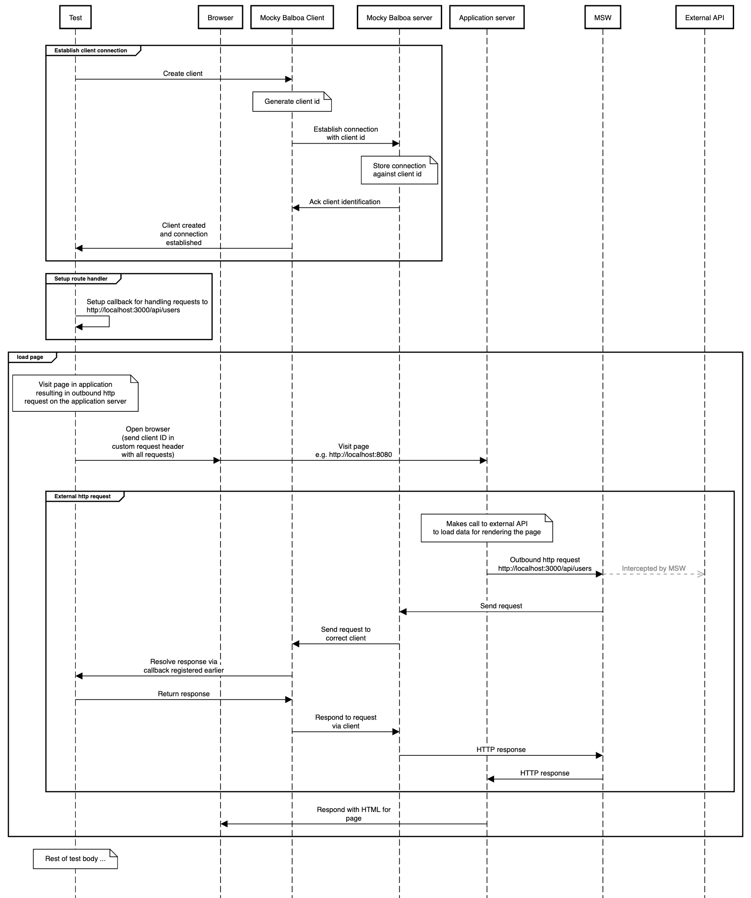

import Tabs from '@theme/Tabs';
import TabItem from '@theme/TabItem';

# Advanced

If you are interested in contributing to Mocky Balboa, or just want to learn more about how it works then read on! If you're looking to just get started, then go back to the [Getting Started](./getting-started) page.

## Sequence flow diagram

Below is a sequence flow diagram that illustrates the flow of a test in a browser automation framework interacting with your application server. The diagram shows what happens when the application server makes an outbound HTTP request to an external API and how the response is processed by the Mocky Balboa server and client.

<figure>

<figcaption>_[Diagram source](./images/mocky-balboa-sequence.txt) made with [https://sequencediagram.org/](https://sequencediagram.org/)_</figcaption>
</figure>

There's a lot going on here, but don't worry, we'll break it down step by step.

### Step 1: Establishing a connection to the Mocky Balboa server

The first step in our test is to establish a connection to the Mocky Balboa server. This is done by creating a new instance of the Mocky Balboa client and calling the `connect` method. This is all abstracted away from the user via the first class integrations. Here's how it looks in the Playwright integration:

<Tabs groupId="javascript-language">
  <TabItem value="typescript" label="TypeScript" default>
        ```TypeScript
        import { test } from "@playwright/test";
        import { createClient } from "@mocky-balboa/playwright";

        test("my page loads", async ({ context, page }) => {
            const client = await createClient(context);
        });
        ```
  </TabItem>
  <TabItem value="javascript" label="JavaScript">
      ```JavaScript
      import { test } from "@playwright/test";
      import { createClient } from "@mocky-balboa/playwright";

      test("my page loads", async ({ context, page }) => {
        const client = await createClient(context);
      });
      ```
  </TabItem>
</Tabs>

Behind the abstraction we're doing a couple of things:

1. We're creating a new instance of the Mocky Balboa client `import { Client } from "@mocky-balboa/client";`.
1. We're calling the `connect` method on the client.
1. We're setting extra HTTP headers on the Playwright browser context. This is how we match outbound requests to the client that initiated the request.

### Step 2: Register our network fixture

Next we're going to fixture our external API call that's going to be triggered when we try to load our page. We'll do this directly on the client:

<Tabs groupId="javascript-language">
  <TabItem value="typescript" label="TypeScript" default>
        ```TypeScript
        client.route("**/api/users", (route) => {
          return route.fulfill({
            status: 200,
            body: JSON.stringify([
              { id: "user-1", name: "John Doe" },
              { id: "user-2", name: "Jane Doe" }
            ]),
            headers: {
              "Content-Type": "application/json"
            },
          });
        });
        ```
  </TabItem>
  <TabItem value="javascript" label="JavaScript">
      ```JavaScript
      client.route("**/api/users", (route) => {
        return route.fulfill({
          status: 200,
          body: JSON.stringify([
            { id: "user-1", name: "John Doe" },
            { id: "user-2", name: "Jane Doe" }
          ]),
          headers: {
            "Content-Type": "application/json"
          },
        });
      });
      ```
  </TabItem>
</Tabs>

This is the code that's going to be executed when our application server tries to fetch on our `http://localhost:3000/api/users` endpoint.

### Step 3: Now we can load our page

<Tabs groupId="javascript-language">
  <TabItem value="typescript" label="TypeScript" default>
        ```TypeScript
        await page.goto("http://localhost:8080");
        ```
  </TabItem>
  <TabItem value="javascript" label="JavaScript">
      ```JavaScript
      await page.goto("http://localhost:8080");
      ```
  </TabItem>
</Tabs>

This will trigger our call to the `http://localhost:8080/api/users` endpoint. Mock Service Worker (MSW) will intercept the request and delegate resolving the response to the client.

### Step 4: Write the test assertions

The rest of your test will then execute. Once the browser context has been closed, the client will be disconnected.

## How does it work?

The real magic happens inside our server. We wrap the application server in a parent process that's responsible for also spinning up the Mocky Balboa WebSocket server. We run the handler for the application server in an [AsyncLocalStorage](https://nodejs.org/api/async_context.html) callback. The trace for this storage is set to the client ID, the one we passed to the server via the custom header. This is the glue which ensures the server sends messages to the correct client allowing us to run our tests in parallel.
